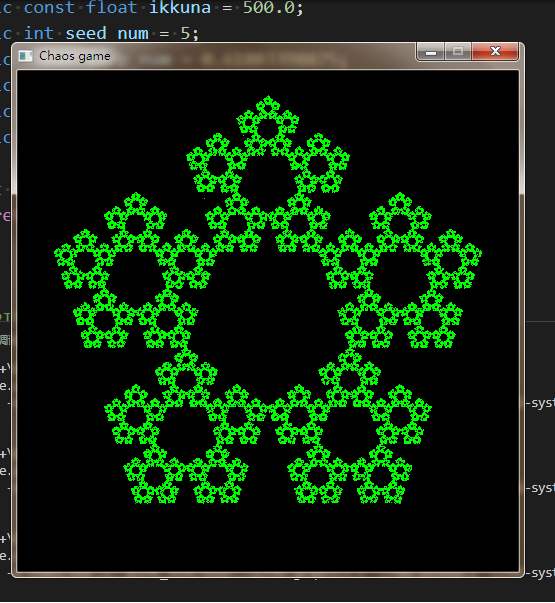

# Chaos game(But bad)

Okei, eli tässä on C++/SFML koodi minun tekemästäni Chaos gamesta. Koodi on todella surkeaa, mutta koeta kestää.

## Käyttöohjeet
- Käyttä näppä:
    - Liikuu: ASWD
    - Zoomaa: Z ja X
- Tarvitse <code>make</code>, <code>sfml</code> ja <code>g++</code>
    - make run
- <code>Chaos_game.cpp</code>:n 13 ja 14 riivillä lukee: 
```c++ 
static int seed_num = 5;
static float lerp_num = 0.61803398875;
```
Voit muokaa nämä. <code>Chaos_game.cpp</code>:n 24 riivillä on ohje.

## Kuvakaappaukset


